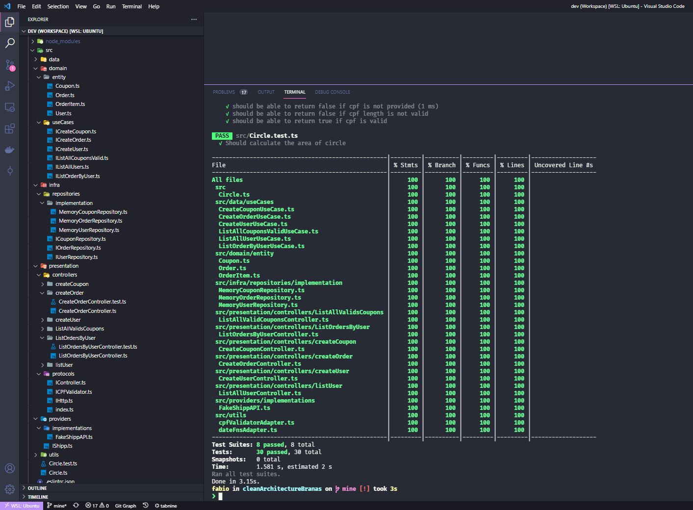

<h1 align="center">Welcome to Clean Arch with Rodrigo Branas 👋</h1>
<p>
  
  <a href="#" target="_blank">
    
  </a>
  <a href="https://twitter.com/fabioods" target="_blank">
    
  </a>
</p>

<p align="center">
  
</p>

> Projeto sobre a aplicação de arquitetura limpa desenvolvido no curso do Rodrigo Branas

## Branches

- [master] - É o branch principal do projeto, os arquivos daqui veem do branch mine;
- [mine] - É o branch onde eu implementei com base nos meus conhecimentos sobre o curso do Rodrigo Branas & Rodrigo Manguinho;
- [branas] - É o branch onde segui a implementação realizada em aula com o Rodrigo Branas;

## Install

```sh
yarn install
```

## Run tests

```sh
yarn test
```

## Author

👤 **Fábio dos Santos <fah_ds@live.com>**

- Twitter: [@fabioods](https://twitter.com/fabioods)
- Github: [@fabioods](https://github.com/fabioods)
- LinkedIn: [@fabioods](https://linkedin.com/in/fabioods)

## Show your support

Give a ⭐️ if this project helped you!

---

_This README was generated with ❤️ by [readme-md-generator](https://github.com/kefranabg/readme-md-generator)_
